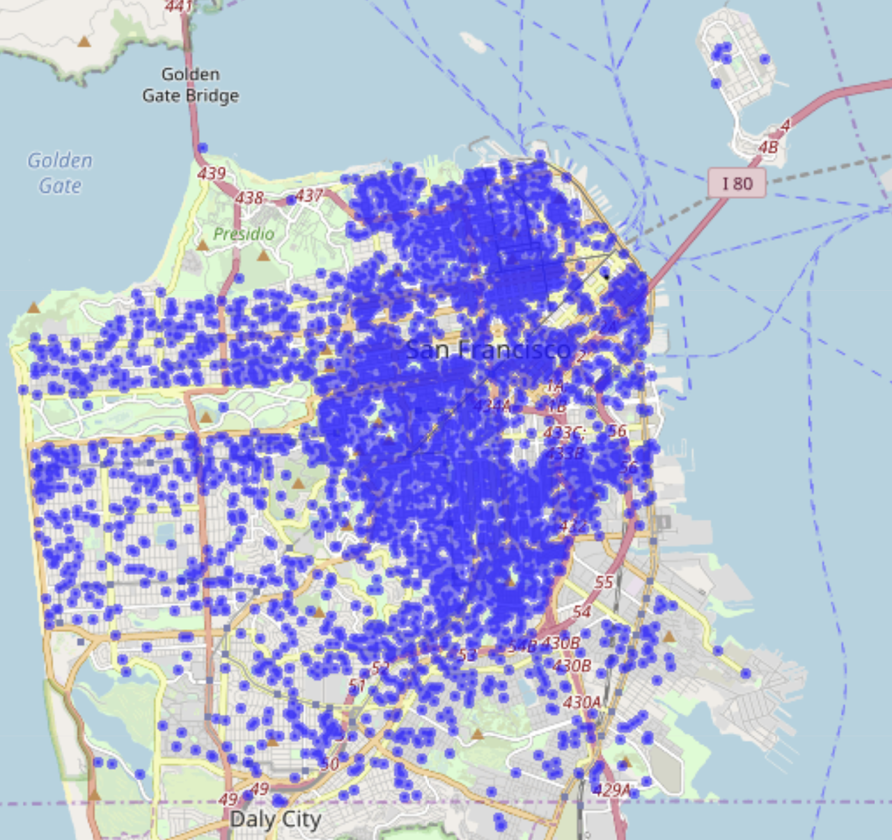
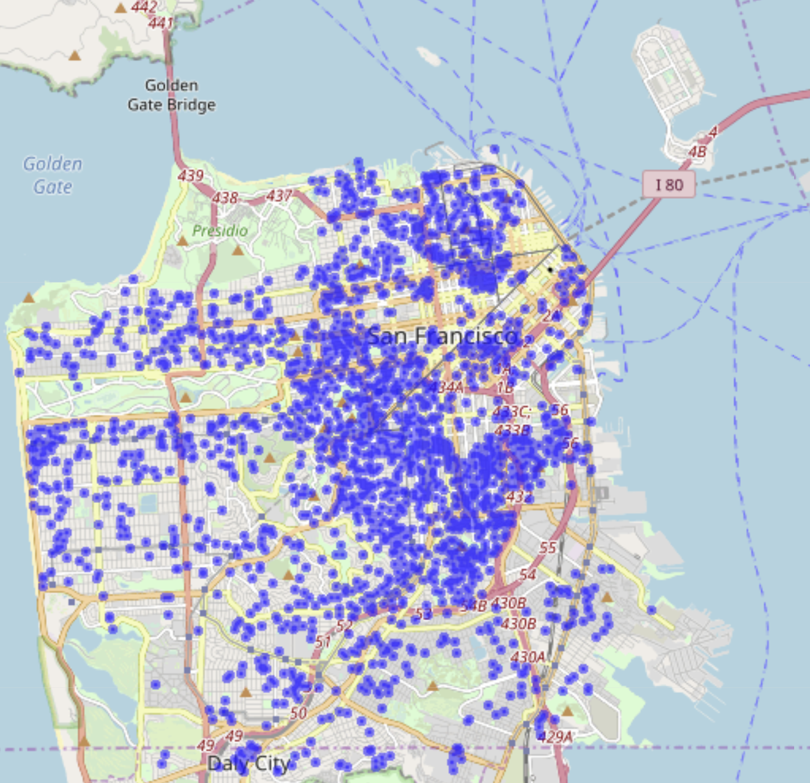
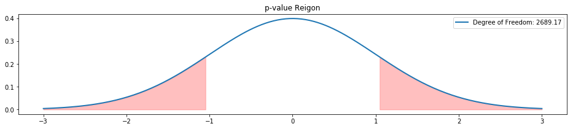

## Impact of San Francisco's short-term rental regulation on the supply and pricing of Airbnb listings

### Link to the presentation:

https://drive.google.com/open?id=1kbgBahYtDttEf9qDHZhhtpx3_KRkE1Bf

### Motivation:

As a data scientist with many years' experience in economic consulting, I'm naturally drawn to studying the dynamics of supply and demand as well as the impact of regulation on the marketplace. Despite its tremendous success, Airbnb has been involved with legal disputes with numerous cities with regard to the legitimacy of short-term rentals. It is particularly interesting in the sense that these regulations are highly localized as a result of Airbnb's efforts to reach agreements with individual cities where its operation has been challenged. 

Upon settling a lawsuit with the City of San Francisco in May 2017, Airbnb agreed to help enforce San Francisco's existing short-term rental laws on its platform. As the first phase of my capstone project at Galvanize, I intended to assess the reduction of listings (i.e. supplies) as a result of the newly enforced regulation and to assess whether there were any significant changes in the prices.

### Data Source:

The primary data source is the <a href="http://insideairbnb.com/get-the-data.html" target="_blank">InsideAirbnb</a> website. 

Due to the fact that the city-specific data has been scraped at roughly a constant time interval (once a month) since 2015, the combined data-set is essentially a panel data. This is extremely valuable for a wide range of topics, e.g. churning and forecasting.

### Data Pipeline:

Raw data is organized as .gz files on the InsideAirbnb website. To make the data ingestion process accurate and scalable, I developed a BeautifulSoup script that scraped all of the hyperlinks on "http://insideairbnb.com/get-the-data.html". This includes links of files associated with other cities and countries. After that, I developed a function that imports and concatenates city-specific files associated with Listings, Reviews and Calendar, respectively. As of May 31, 2019, there were 45 monthly scraped files for each set of data associated with San Francisco. Three months were scraped twice - November 2017, December 2017 and January 2018. These three months coincide with the period when Airbnb urged hosts to register with the city to meet the compliance requirements. 

Note that the concatenated "Calendar" data adds up to more than 100 million observations. The massive size caused crashes of RAM repeatedly. After several attempts, I decided to filter the data to dates with a maximum of 180 days' lead time from the "current" scraped date. For instance, for the Calendar file scraped on January 1, 2017, only observations up to June 30, 2017 were included in the combined data. 

Overall the data pipeline could be pictured as below:

#### BeautifulSoup ----> Index of Hyperlinks ----> Import and Concatenate Raw Data (unzipping .gz files) ----> Pickle concatenated data ----> SQLITE3/Pandas

Sqlite3 was extensively used. Multiple data tables are stored in a master database called "airbnb.db". The advantage of using Sqlite3 is that the data tables could be queried directly across different Jupyter notebooks.

### Takeaways from EDA (Exploratory Data Analysis)

I initially analyzed the entire Listings data, but subsequently decided to filter the data to listings of which the minimum nights requirement is less than 30 days. This is consistent with how the SF city authority defines "short-term residential rental". All the discussion below is limited to short-term rentals ("STR" hereafter) unless explicitly clarified otherwise.

1. Supply side factors - number of listings:

The number of active listings on Airbnb peaked in 2017 and reached almost 9,000. However, as Airbnb reached an agreement with the city authority in SF and started to alert hosts of the pending new regulation, the number of active listings in SF progressively decreased from November 2017 to February 2018 ("the transition period" hereafter). The number of STR listings appeared to have plateaued around 4,000 since then. There could be multiple reasons for the reduction of supplies in the transition period. Some hosts may have voluntarily removed their listings because they wouldn't or couldn't meet the compliance requirements. Once the midnight of January 16, 2018 passed, Airbnb may have forcefully removed a large number of listings. One week prior to the compliance deadline, there were 5,837 STR listings. On the day immediately after the compliance deadline, the number dropped to 4,505. By February 2, there were only 3,961 listings. Around the same time Airbnb initiated an "Airbnb-Friendly Rental Building" program. Airbnb signed agreements with a few large REITs that own rental properties in SF. Short-term rentals are allowed in a portion of these buildings and in return the REITs got a share of the profits. This process may have encouraged some new hosts to sign up. It is unclear though how the new additions balanced out with the attrition of listings as a result of the new regulation.

The proliferation of STR listings on Airbnb from 2015 to 2017 and the drastic drop in the "transition period" are both evident in the two heat maps below: (the 25th frame in each heat map is associated with November 1, 2017)

[Listings of Entire Home - Heat-map](https://karensheng.github.io/shortterm_entirehome_heatmap.html)

[Listings of Private Rooms - Heat-map](https://karensheng.github.io/shortterm_privateroom_heatmap.html)

When we put the screenshot of November 1, 2017 (start of the "transition period") and February 2, 2018 (end of the "transition period") side by side, the drastic drop in the density of listings geographically became very clear.

2. Room Type and Property Type:

Approximately 54.6% of the listings overall are entire home or apartments whereas 40.4% of the listings are private rooms. Unsurprisingly, only 5% of the listings are for a shared room. Right now, when someone visits Airbnb's website, she/he will discover that, under the "Home Type" filter tab, there is an additional category called "Hotel Room (Have a private or shared room in a boutique hotel, hostel, and more)". However, this change is not reflected in the data as of May 2019. 

At first glance, the categorization of property types (e.g. apartment, house, loft, condominium) does not appear to be standardized in the data. For instance,"apartment" "house" and "condominium" combined account for 89.72% of the listings of private home. However, there are in total 35 categories in property type including "Tiny House" and "Treehouse". Browsing the search page on Airbnb reveals that, in addition to "Property Type", there is a filter called "Unique Homes" where a guest could check categories like "Tiny House" and "Treehouse". This seemingly trivial finding highlights the importance of first-hand experience with any given product for any data science exercises. 

3. Longevity of a listing:

As a two-sided marketplace, retention of both hosts and guests are important to Airbnb. How long a given listing remains active on Airbnb is an indicator of the LTV (lifetime value) of a host. Realistically, host may have multiple listings at a given time or have different listings over time as she/he moves. It appears that a host may not have an active listing long after her/his registration date on Airbnb's website. However, given that a review can only be left within 14 days after the check-out date of a guest, the first review date of a given listing could be used as a proxy of the start of the booking history. Hence, the longevity of a listing is defined as the difference between the first review date and the last "scrape date". (The distributions look roughly the same whether the listings with no reviews are excluded or not.)

The majority of listings appear to remain active for 0-40 months. It might be an interesting project to study the common characteristics of those listings that have remained active for more than 40 months (e.g. number of reviews, location and amenities). For instance, the chart below shows positive correlation between the longevity of a listing and the number of reviews. Caution that no conclusions about causation could be drawn here. 

### Hypothesis Test

I intended to test whether the average price of listings in February 2018, controlling for room type, went up relative to that in February 2017, as a result of almost 50% reduction of listings. February 2017 was chosen as a baseline because I'd like to eliminate seasonality factors. Furthermore, in order to make the listings comparable, only the listings that were active in both February 2017 and February 2018 were included in the sample. To phrase the question differently - "Did the attrition or removal of almost half of the listings drive up the price of these listings that remained active after the compliance deadline?"

It is common practice in the travel/hospitality industry to set prices dynamically based on the lead time of the reservation. Ideally, such prices, as captured by the Calendar data sets, should be used to calculate the average price across listings. In other words, in addition to controlling for common listings, the amount of lead time should be controlled for. However, due to time constraints to complete the first phase of this project, only the "sticker price" in the Listings data was used. "Sticker price" is the price that a guest sees when she/he visits the page of a particular listing. 

Even without controlling for common listings, it appears that even though there were almost twice as many listings in February 2017 as in February 2018, the distributions of prices in these two months are very similar.

There are 1,348 common listings of entire home in February 2017 and February 2018. It appears that the distributions almost entirely overlap.

Formally, I used Welch's t-test to test the null hypothesis that the mean difference of prices is 0 in these two months.

H0: price_Feb2017 - price_Feb2018 = 0
H1: price_Feb2017 - price_Feb2018 != 0

p_value is 0.3

I failed to reject the null hypothesis that the mean difference of prices is 0. 

This conclusion is quite counter-intuitive. Several factors may explain the stability of the price. 

* February may be a conventionally slow season for short-term rental reservations and the expected price hike due to the reduction of supplies is not reflected in the "sticker price".

* There may have been a significant change in the prices but it's reflected in the Calendar data only.

* Hosts mostly assign the "sticker price" based on Airbnb's recommendations, and for some reason, Airbnb's recommended prices didn't reflect the change of supplies. 

* There may have been an oversupply on Airbnb prior to the "transition period". Attrition or removal of almost half of the listings may have brought the market to equilibrium. Notably, the number of listings has hovered around 4,000 since February 2018 and has never recovered the peak level in 2017. To test this conjecture, it's worthwhile studying the reservation and reviews history of those listings that were voluntarily or involuntarily removed in the "transition period". To further investigate this, the number of reviews, again, may be used as a proxy to assess the demand prior to and after the January 2018 compliance deadline.

### Next Steps

I'd like to continue to look into the prices reflected in the Calendar data and to verify the conjectures I formulated above. Ideally, the price series should be charted year over year so that it's easy to spot seasonality and any drastic changes, if there were any. 

In addition, I'd like to perform more in-depth analysis of the demand side factors, which largely rely on the Reviews data. 

For the second capstone,  I’d like to use multiple machine learning techniques to build a predictive model of prices that incorporates amenities, location, seasonality, lead time, etc.

